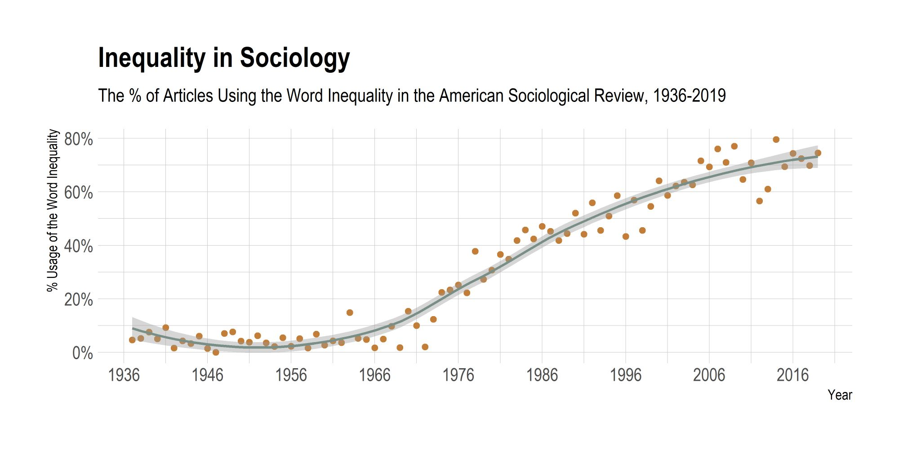
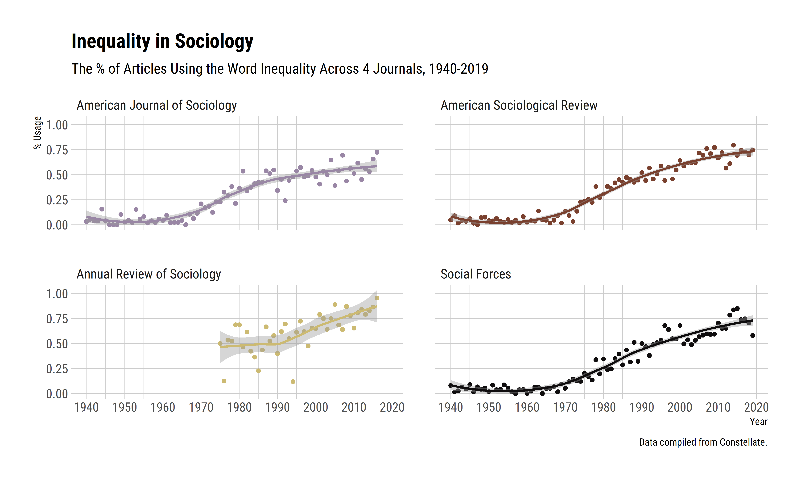

A few months ago Beth Popp Berman posted [a tweet](https://twitter.com/epopppp/status/1585804781204881410), saying "I love you, sociologists, but do *all* of us have to work on inequality?"

This generated a plethora of responses from sociologists on Twitter, some arguing that "inequality" defines the subject-matter of sociology (much like "markets" in economics), while others emphasizing the pervasive feeling that inequality per se has become *the* topic of sociology, broadly construed. Going forward, one particularly interesting response stated that ["a prof once told me that if I want to publish in a top sociology journal, I need to emphasize how a social process I’ve identified in my research perpetuates or exacerbates inequality."](https://twitter.com/chiarapack/status/1585842671972909061)

I wondered if this was indeed the case and compiled all articles published in the *American Sociological Review* between 1936 and 2019 from the [Constellate](https://constellate.org/), and counted the number of articles which include the words "inequality" or "inequalities" anywhere in the manuscript.[^1]

[^1]: This is, admittedly, a "broad" net, though if the sentiment expressed in the tweet is correct, *mentioning* inequality should be enough of a sign for this issue.

Figure below shows the results from this exercise.

|                       |
|:-------------------------------------------------------:|
| *Figure 1 : Inequality in American Sociological Review* |

It is fair to say that *something* happened in sociology over these last few decades.

The data show that nearly 4 out of 5 articles published in the ASR mentioned inequality in one form or another. If we make a perhaps dubious assumption that ASR represents the core output of this discipline, these trends mean that the overwhelming majority of sociologists talks about inequality.

**Update, July 2024**. I also generated a better quality version of the first figure, including data from *American Journal of Sociology*, *Annual Review of Sociology*, and *Social Forces*, with a more in-depth quality control for the article counts.

|                    |
|:----------------------------------------------------:|
| *Figure 2: Inequality in Top Sociology Journals*     |

This echoes an ethos in our professional culture as well, an example being the conference themes of American Sociological Association within the last few years, reproduced below:

-   2023: The Educative Power of Sociology,
-   2022: Bureaucracies of Displacement,
-   2021: Emancipatory Sociology: Rising to the Du Boisian Challenge,
-   2020: Power, Inequality, and Resistance at Work,
-   2019: Engaging Social Justice for A Better World,
-   2018: Feeling Race: An Invitation to Explore Racialized Emotions,
-   2017: The Culture, Inequalities, and Social Inclusion Across Globe,
-   2016: Rethinking Social Movements: Can Changing the Conversation Change the World,
-   2015: Sexualities in the Social World,
-   2014: Hard Times: The Impact of Economic Inequality on Families and Individuals,
-   2013: Interrogating Inequality: Linking Micro and Macro.

Again, the majority of our overwhelming discussions revolve around inequality, in one form or another.

This is perhaps not surprising. Given massive inequalities across class, race, and gender, it would be unexpected *not* to talk about inequality. That said, it is hard to overlook the fact that the majority of *research* output might be localizing in this area, too. If this is not just a folk observation and there is indeed a growing trend to inequality research as a somewhat field-defining phenomenon, this should have certain consequences for the long-term evolution of sociology.

Evidence [suggests](https://journals.sagepub.com/doi/full/10.1177/00031224211056267) that "students were most likely to achieve influential field positions when they targeted certain topics reflective of the cultural turn or statistical models rather than adopting a thematic focus in general." This basically means, *economics alert*, there are *incentives* at play. It is fair to say that sociology has already a reputation, especially across U.S. universities, for being particularly attuned to the study of inequality. If there is indeed a strong clustering around inequality research as well, this might mean that the disciplinary socialization of the new generations of sociologists will find inequality as the principal research agenda of the field---that is, if this is not already happening.

I think this could actually be quite beneficial, particularly for disciplinary clarity. Yet, these trends also imply that, at the end of the day, we have an "inequality problem" in sociology right now. This has strong implications on what sociological theory is, what we mean when we say something is *sociological*, and what the long-term outlook of our field is. This deserves a discussion.
