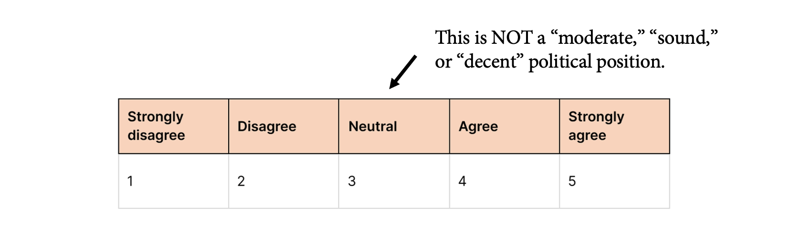

One of the most popular themes in current social science research is *rising political polarization*.

This is perhaps to be expected. Starting with the 2010s, high-profile social science research has become hyper-sensitive to certain types of questions, particularly after the election of Donald Trump, the scandals around Cambridge Analytica, and the broad discourse around echo chambers and partisan polarization. This agenda is pursued on multiple areas. We can roughly characterize it as a family of projects pertaining to misinformation, fake news, cross-party animus, echo chambers, affective polarization, persuasion, and social-scientific *strategies* that combat against these social problems.

This is high-profile, as evidenced, if nothing else, by Biden Administration's [National Strategy for Countering Domestic Terrorism](https://www.whitehouse.gov/briefing-room/statements-releases/2021/06/15/fact-sheet-national-strategy-for-countering-domestic-terrorism/), which emphasizes that the U.S. government will work to "find ways to counter the polarization often fueled by disinformation, misinformation, and dangerous conspiracy theories online." The research appears in top discipline journals, and general science journals like *Science* and *Nature* feature a lot about this topic.

I do believe, however, that polarization research has a fundamental problem: **it has a "centrism bias" in how it theorizes about social and political phenomena.**

I define "centrism bias" as a theoretical framework that conceptualizes political polarization as a *social problem* and proposes strategies that hinge on *moderation*. According to this framework, rising political polarization involves certain cognitive, behavioral, and social infrastructures, and we should find ways to promote moderation over extremism, social pluralism over social divisions, and institutional consensus over anti-establishment or anti-institutional political positions.

We can see this attitude in a recent *Current Directions in Psychological Science* [paper](https://journals.sagepub.com/doi/full/10.1177/09637214241242452), motivated by a proposal that perfectly encapsulates this centrist position: "research on attitude change should provide an answer," the authors claim, "regarding how people might be persuaded to move away from the extremes to take a moderate stance," proposing "interventions" that may achieve this goal.

I believe that this position leads to three outcomes:

(1) It casts polarization as an inherently “bad” phenomenon. That’s why it is a social problem. In characteristic fashion, researchers warn about the dangers polarization poses to "pluralistic societies" all the time.
(2) The social problem approach necessitates a solution, leading scholars to devise strategies that *mitigate* or at least *reduce* political polarization. We thus see various experimental manipulations that explicitly aim for reducing political divisions.
(3) It promotes a sense of urgency and moral panic that casts growing partisan differences as the leading cause of groupism, motivated cognition, and hyper-politicism in democratic nations.

Of course, scholarly work on polarization is more than this. There is a well-researched and formally rigorous study of polarization in sociology, political science, and economics. Studies define polarization as [a distributional property of public opinion](https://www.journals.uchicago.edu/doi/abs/10.1086/230995), [the sorting of attitudinal positions to political identities](https://www.journals.uchicago.edu/doi/abs/10.1086/590649), or [the consolidation of political beliefs](https://journals.sagepub.com/doi/abs/10.1177/0003122420922989). In all cases, we see that polarization has a rather "mechanical" definition, a processual account that describes a specific distributional property of political positions in society.

Contrast this to the goal of persuading people "to move away from the extremes to take a moderate stance." The former describes polarization as a group-level phenomenon of sorting, a definition that does not necessarily include an evaluative component, while the latter inherently favors a "thick" conception where *extreme* attitudes, behaviors, or social relations both non-evaluatively describe the social situation *and* evaluatively assign a moral and political danger. Immediately, polarization becomes a problem rather than a question of public opinion---a problem needing intervention rather than theorization.

This is problematic on at least two grounds. Scientifically, a thick conception of polarization strongly hinges on an implicit political commitment to establishment centrism that mitigates a rigorous, clear, and formal definition of opinion dynamics. In fact, advocating definitions that prioritize thick concepts like extremism or moderation over definitions that prioritize formal dynamics of belief systems is antithetical to the scholarly enterprise. Politically, a centrist bias leads to a demonization of all anti-establishment movements, the historical likes of which, for instance, included racial justice movements.

The upshot: centrism bias is, uh, bad. Scholars need to avoid treating the middle response of a Likert scale as a moderate, politically sound, or decent political position.

