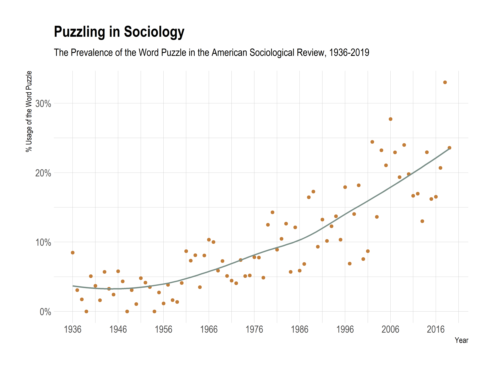

One distinctive feature of academic socialization is to cultivate sensibilities for good puzzles. We need, one hears all the time, interesting research puzzles that work as a *motivation* for our scientific pursuits, an *intellectual justification* for the readers (["That's interesting!"](https://proseminarcrossnationalstudies.files.wordpress.com/2009/11/thatsinteresting_1971.pdf)), and a *theoretical contribution* for the reviewers. If anything, a good puzzle is a sign of a curious mind, someone who appreciates the intricacies of the real world. This is reflected in texts designed to provide wise suggestions to researchers, and a cursory look at the articles in the *American Sociological Review* from 1936 to 2019 (see the Figure below) confirms this wisdom, showing that the puzzles have, in fact, been increasing.

|                      |
|:-------------------------------------------------:|
| *Figure: Puzzles in American Sociological Review* |

I have no wise arguments about the reasons for this increase, but I have serious concerns about the consequences of puzzling in sociology.

Using Kieran Healy's poetic rendering, [*Fuck Nuance*](https://kieranhealy.org/files/papers/fuck-nuance.pdf), let me say *Fuck Puzzles* and list three puzzle traps that push sociologists to unwarranted strategies of research.

We can call the first puzzle trap "the seek-and-ye-shall-find problem."[^1] Basically, if you are bound to find puzzles and if you look hard enough, you will find one. This is because there are tons of idiosyncratic and, well, puzzling situations that do not represent much of the distribution. We might have a reasonable theory for understanding occupational mobility, but the theory might not work for this fringe group of 30 I found in a censored Reddit sub. This, of course, does not exclude the possibility that exceptional cases, by being exceptional, have nice [theoretical properties](https://www.jstor.org/stable/24467499). What I say is that trying to find puzzles might be pushing an incentive *to actively seek and find exceptional cases*. If theories are abstractions of some sort, "accounting for" the far tails of the distribution might not be a good idea unless we come to the (unlikely) realization that the tail was, in fact, the peak of the distribution. Nobody expects the Spanish Inquisition, and saying that the Spanish Inquisition was actually everywhere is kind of silly.

[^1]: John Levi Martin uses this term in his 2017 *Thinking Through Methods* (see page 46) to emphasize selectivity in field-sites.

There are also certain times when researchers find a discrepancy between their most cherished theoretical language, which most of the time lacks syntax proper but contains an enormous vocabulary, and some set of real-world observations, so finding this *puzzling*, researchers *clarify* the issue by inventing a new word for the said observations. We might call this "the conceptual inflation problem," i.e., an excess supply of different words for essentially the same thing. Now, the invention of concepts has much deeper problems (such as nuance!), but the push for puzzles goes hand in hand with the push for theoretical contributions here. The puzzles are highly instrumental to setting up some problems that are actually just confusions about the language, rather than the theoretical apparatus. Inventing a new (truer) word, the researcher now makes a theoretical contribution. This is not only debilitating to the theory, it also makes it really hard for subsequent researchers to connect the threads for an overarching paradigm.

The third trap comes from Ashley Mears's "[Puzzling in Sociology: On Doing and Undoing Theoretical Puzzles](https://journals.sagepub.com/doi/10.1177/0735275117709775)." Mears criticizes the process of deductivising the puzzle, which involves a "skillful puzzle-muster construct\[ing\] such a puzzle as to deconstruct it in one stroke" (142). If, Mears argues, the research process is actually inductive (we usually come up with a puzzle *after* we find some significant results), it is problematic to present the process in deductive terms. In contrast to Mears, though, I think the argument has a flip side: what happens to a deductive argument when we retrofit a puzzle to it? Think about the famous theorems from social-scientific thinking: [Arrow's impossibility theorem](https://plato.stanford.edu/entries/arrows-theorem/), or the [Wisconsin model of socio-economic attainment](https://en.wikipedia.org/wiki/Wisconsin_model). Neither of these theories wrestles with a scientific puzzle — they just follow some assumptions or models and see if they explain something about the world. Trying to find a puzzle just to redress an argument of this sort would just create a false appearance of surprise. We can call this "the retrofitting of surprise problem."

I believe puzzle-making is a dangerous strategy, one that might lead to bizarre or exaggerated claims about the world. Perhaps unintuitively, it is much more atheoretical than theoretical. Most of all, I feel that the emphasis on puzzling undermines establishing robust and cumulative theoretical programs that simply want to understand the world.
